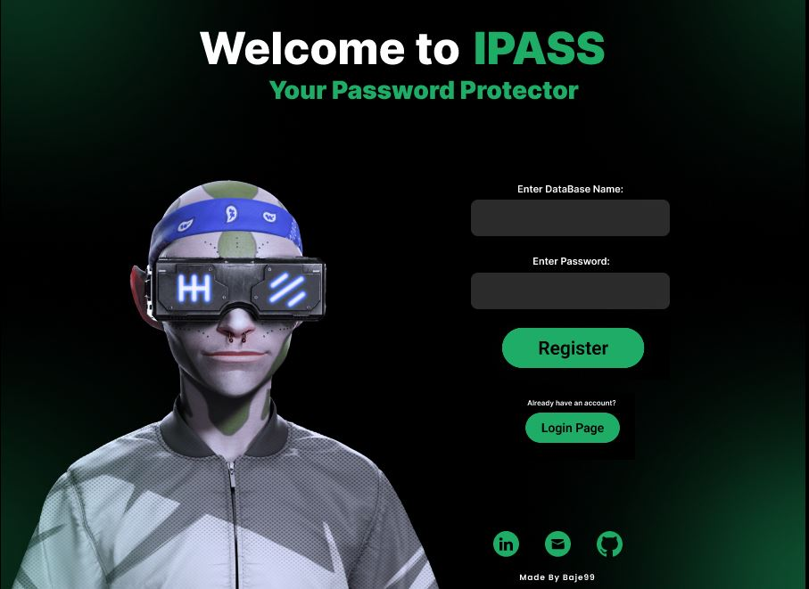

 
    

<h1 align="center">IPass</h1>

  
  

<h2 align="center">
A simple and secure password manager that helps you generate and store strong passwords.
</h1>

 
    

## Features

- Encrypt and decrypt passwords entered by user using AES 256
- Store passwords in an encrypted database using MySql
- Access passwords with a single master password
- Securely delete passwords from the database

## Installation

To use this password manager, you need to have Python 3.x installed on your machine. You can download and install Python from the [official website](https://www.python.org/downloads/).

To install the required dependencies, run the following command:

pip install -r requirements.txt

To use this password manager, you need to have MySql from this [website] (https://www.mysql.com/downloads/). After installing you will need to configure the connection with the program in the installation process( setting the username (ex: root), password, which we will need to insert in main.py)
For more help regarding the installation process of MySql check this [link](https://www.youtube.com/watch?v=2c2fUOgZMmY) ( for windows 10).

## Usage

To start the password manager, run the following command:

python main.py

You will be prompted to create a master password to secure your passwords database. After that, you can use the menu options to encrypt, store, and access your passwords.

## Contributing

If you want to contribute to this project, please follow the [contribution guidelines](https://github.com/username/password-manager/blob/main/CONTRIBUTING.md). Any help is welcome, from bug reports to feature requests and code contributions.

## License

This project is licensed under the [MIT License](https://github.com/username/password-manager/blob/main/LICENSE). Feel free to use, modify, and distribute this code as long as you include the original copyright notice and license terms.

---

  Made with :heart: by Baje99

